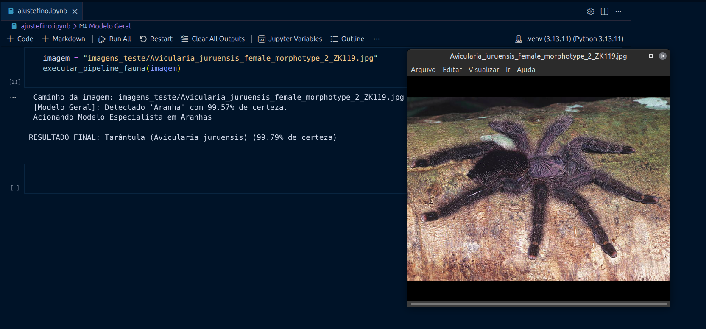

# 🐾 Bichohub - Triagem Digital

<p align="center">
  
</p>

Este projeto implementa uma arquitetura de visão computacional em cascata (hierárquica) para a identificação de animais, com foco especial na fauna brasileira e sul-americana. 

Em vez de treinar um único modelo complexo para discernir centenas de espécies simultaneamente, o sistema utiliza um **Modelo Geral** leve e altamente otimizado para identificar a classe do animal. Caso o animal seja uma **Cobra** ou uma **Aranha**, o pipeline aciona automaticamente um **Modelo Especialista** dedicado para refinar a classificação a nível de espécie.

---

## 📐 Arquitetura do Sistema

O fluxo de execução funciona em dois níveis de decisão:

1. **Nível 1 (Modelo Geral):** Classifica a imagem entre 10 categorias principais (Ex: Iguana, Sapo, Macaco, etc.). Se detectar "Cobra" ou "Aranha", o fluxo é direcionado para o nível seguinte.
2. **Nível 2 (Modelos Especialistas):** Modelos dedicados que só entram em ação quando disparados pelo Nível 1, garantindo alta precisão biológica em cenários de classificação fina (espécies).

---

## 📂 Estrutura de Datasets

Os dados brutos foram organizados e divididos automaticamente em proporções de **Treino (70%)**, **Validação (20%)** e **Teste (10%)** utilizando scripts automatizados para evitar a sobreposição de arquivos e vazamento de dados (*data leakage*).

### 1. Dataset Geral (`animais_geral/`)
Agrupa todas as espécies de cobras e aranhas em suas respectivas categorias macro para treinar o classificador do Nível 1.
* **Classes (10):** `Aranha`, `Calango-de-Pedra`, `Cobra`, `Cutia-de-Crista`, `Iguana-Verde`, `Jacaretinga`, `Macaco-de-Cheiro`, `Parauacu-de-Cara-Branca`, `Preguiça-de-Bentinho`, `Sapo-Cururu`.

### 2. Datasets Especialistas (`animais_especialista_.../`)
Pastas isoladas contendo apenas as imagens divididas por espécies para o refinamento do Nível 2 (Ex: *Aranha-Marrom*, *Armadeira*, *Cascavel*, *Jararaca*, etc.).

---

## 🚀 Modelos e Hiperparâmetros

Para todas as etapas, foi utilizada a arquitetura **YOLO-cls (Ultralytics)**, especificamente projetada para classificação de imagens de alta performance. 

Devido ao tamanho reduzido do dataset (algumas classes possuindo entre 10 e 40 imagens), foram aplicadas técnicas agressivas de **Aumento de Dados (Data Augmentation)** e regularização para prevenir o *overfitting*:

* **Modelo Geral:** Treinado com rotações horizontais e alterações de brilho/escala.
* **Modelos Especialistas:** Configurados com taxa de aprendizado reduzida (`lr0=0.002`) para um ajuste fino cirúrgico, além de giros verticais (`flipud=0.5`) e rotações de até 90°, considerando que cobras e aranhas assumem geometrias tridimensionais complexas na natureza (subindo em árvores, galhos e tetos).

---

## Como Executar o Projeto

### 1. Pré-requisitos
Certifique-se de ter o ambiente virtual (venv) configurado, com as dependências instaladas:

```bash
pip install -r requirements.txt

```

### 2. Dataset

Baixe e extraia o Dataset_v2 disponível no nosso Drive

### 3. Hierarquia das pastas

A hierarquia do projeto deve estar assim

```
📦models
 ┣ 📂Dataset_v2
 ┣ 📂runs
 ┃ ┗ 📂classify
 ┃ ┃ ┗ 📂Triagem
 ┃ ┃ ┃ ┣ 📂Especialista_Aranhas
 ┃ ┃ ┃ ┃ ┣ 📂weights
 ┃ ┃ ┃ ┣ 📂Especialista_Cobras
 ┃ ┃ ┃ ┃ ┣ 📂weights
 ┃ ┃ ┃ ┗ 📂Geral
 ┃ ┃ ┃ ┃ ┣ 📂weights
 ┣ 📜README.md
 ┣ 📜ajustefino.ipynb
 ┗ 📜requirements.txt

```